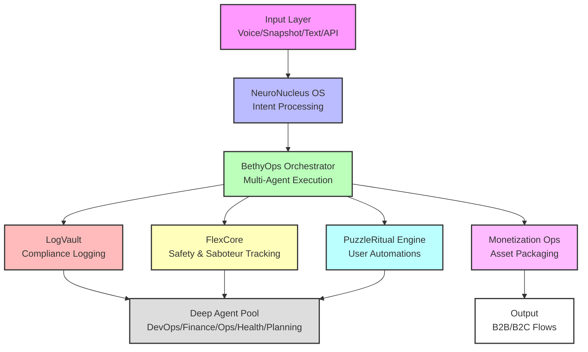

# HelenKella Godmode System Architecture (2025)

This page provides an updated, integrated synthesis of the Neunuc/HelenKella Godmode system, reflecting all current architecture, workflow, and platform updates.

## Core Principle

Neuro-Inclusive AI OS (Godmode) for multi-agent, intent-based workflow automation; everything modular, event-driven, micro-utility ("One Job, One Bot").

## Key Core and Subsystems

- **NeuroNucleus OS**: Turns ambiguous "want/need" into a structured execution plan. Built on Gemini-Supabase-Knowledge Graph.
- **BethyOps Orchestrator**: Voice/multi-agent runner, drives execution via GCP Cloud Run, Discord, iOS, etc.
- **LogVault**: Immutable compliance/consent ledger (GDPR/CCPA focus).
- **FlexCore**: Emotional/psychological safety, trauma flags, saboteur/interruption tracking.
- **PuzzleRitual Engine**: No-code user automations/ritual logic, Recovery Ritual Market for customizations.
- **Monetization Ops**: Asset/package automation, Stripe/S3/licenseKit deployment for B2B/B2C flows.
- **Deep agent pool**: Specialized bots for DevOps/Finance/Ops/Health/Planning; all governed by orchestration and compliance.

## Key Integration & Compliance Flows

- Modular plug-and-play via Master API layer
- Voice/NLP/iOS/Discord frontends
- Unified, exportable log & compliance layer (LogVault)
- Automated context/intent enrichment (emotional state, crisis protocol)

## Latest Workflow Automation

Layered workflow:

1. **Input** (voice/snapshot/text/API)
2. **Orchestration & Reasoning plan generator**
3. **Multi-agent execution** (BethyOps sub-agents)
4. **Consent/Compliance logging** (LogVault)
5. **Monetization/export packaging** (as needed)

Supports MVP expanding to B2B compliance, licensing, SSO, and financial flows. Docs-as-code with daemon for self-updating and continuous integration.

## Architecture Diagram

## Next Actions/Checklist

1. Use *inventory* to map all active and planned modules.
2. Validate/uphold modular, micro-utility/plug-and-play agent strategy.
3. Continue automating compliance, consent, and policy enforcement.
4. Export/diagram updated system in mermaid/markdown as living architecture.
5. Refine for scaling, monetization, and enterprise/B2B pilot readiness.

## References

- [Godmode Overview](overview.md)
- [Architecture](architecture.md)
- [Subsystems](subsystems.md)
- [Discord Voice Integrations](discord-voice-integrations.md)